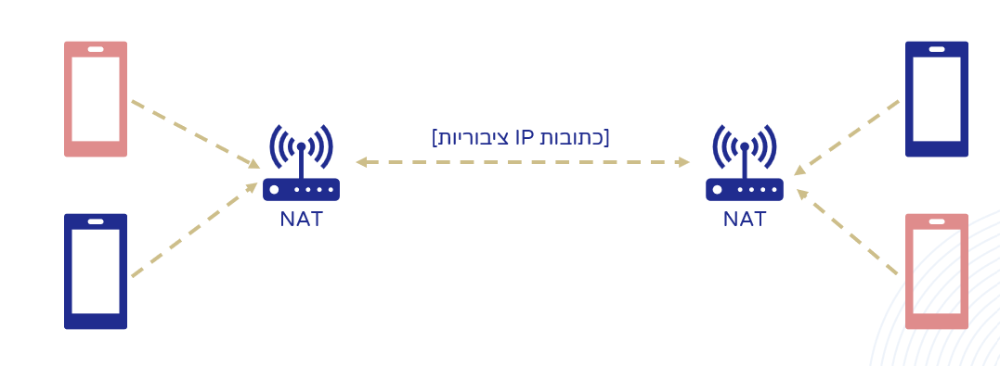

###

"BUSINESS OPPORTUNITIES ARE LIKE BUSES. THERE'S ALWAYS ANOTHER ONE COMING"
### How do existing solutions work?

### Disadvantages of Using Relay Servers

The main disadvantage of using relay servers is that they cause communication to take a longer route over the internet, resulting in slower data transmission. Because there is an additional node in the path—the server—data packets containing the audio need to reach the server before being forwarded to the recipient. This inefficient communication leads to a delay of more than twice the average delay of direct peer-to-peer (P2P) communication between clients. As Yotam mentioned, a delay of over 120 milliseconds is noticeable to most people and disrupts their experience. When using relay servers to transmit audio over the internet, latency is often higher than 120 milliseconds. Therefore, using relay servers adversely affects call quality due to the inefficient communication that causes audio delay between the parties.

Another drawback is that the relay server performs a very heavy operation: it needs to stream the audio throughout the entire call. Every data packet that Alice wants to send to Bob or Bob wants to send to Alice must first be sent to the server and then forwarded to the other side, which is a very resource-intensive operation. To support many simultaneous calls, a very large and powerful server network is required. Additionally, in order to minimize latency, servers often need to be distributed globally so that they are geographically close to users. This is done to ensure that the routing path between them and the users is shorter. Therefore, using relay-based communication requires a huge amount of processing and network resources to support such an application at large scale.

## Peer-to-Peer Communication

Peer-to-peer (P2P) communication, which involves direct communication between clients, is the best way to minimize the time it takes for audio to be transmitted from one client to another (Delay/Latency). 

P2P communication also significantly reduces the operational costs of the application.

However, existing solutions in the market do not allow for P2P communication in most networks.

The reason: a technological challenge.

## The problem?
### Network Address Translation

(the "solution" is Relay server)

### Common Types of NAT (Network Address Translation)

## Demo of the Pulse

## Latency comparison 

## Encryption and Security

Traditional telephone call encryption solutions provide better latency compared to other solutions in the market (including Pulse), but they lack a "defense" layer for calls, making it easy to eavesdrop and spoof calls over the telephone network.

Pulse includes an end-to-end encryption mechanism that prevents eavesdropping on calls passing through it, even by its server operators.

All audio is encrypted using the AES-256 algorithm with a shared key between both parties in the call.

The shared key is securely stored and reused after the first call with the other party to prevent Man-In-The-Middle attacks.

It's possible to preload keys from a file.

### Elliptic-Curve Diffie-Hellman (ECDH)

At the beginning of each call, Alice and Bob each generate a pair of keys (public and private keys). 

They exchange the public keys securely with the server through encrypted and authenticated communication using TLS.

Alice and Bob use the Diffie-Hellman algorithm to generate a symmetric encryption key without transmitting it over the network and without the server knowing it.

We chose an Elliptic Curve-based version of Diffie-Hellman instead of RSA because it allows the use of shorter keys while achieving a stronger level of security. This version is significantly more stringent than the common standard (-bit EC256 is stronger than 3072-bit RSA).

## Technologies Stack

